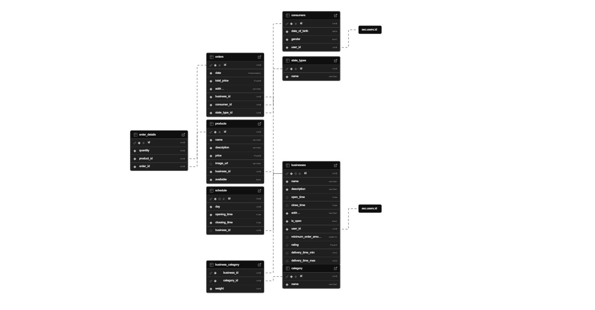
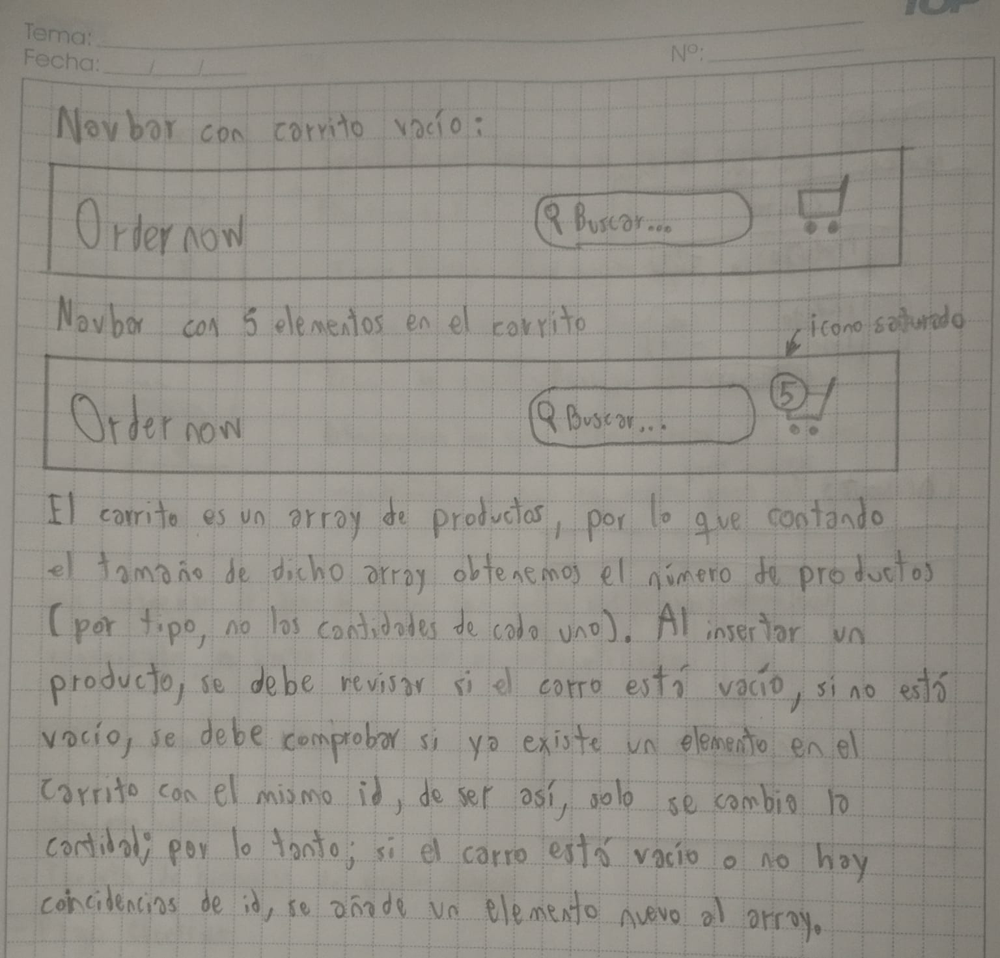
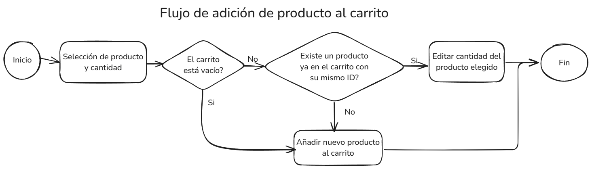
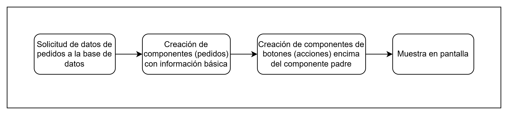
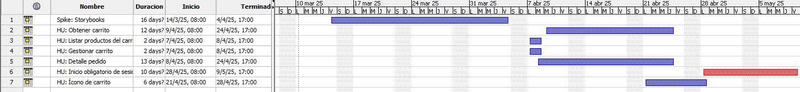

# Wiki del Proyecto: OrderNow

## Índice

- [Wiki del Proyecto: OrderNow](#wiki-del-proyecto-ordernow)
  - [Índice](#índice)
  - [Introducción](#introducción)
  - [Análisis de Requisitos](#análisis-de-requisitos)
    - [Sprint 2](#sprint-2)
    - [Sprint 3](#sprint-3)
    - [Sprint 4](#sprint-4)
  - [Diseño del Sistema](#diseño-del-sistema)
  - [Implementación](#implementación)
  - [Pruebas](#pruebas)
  - [Gestión del Proyecto](#gestión-del-proyecto)
  - [Anexos](#anexos)
  - [Presentación](#presentación)

---

## Introducción

* Descripción general del sistema<br>
Este proyecto consiste en una página de pedidos de comida a restaurantes, consta de dos partes: El lado del cliente, donde un consumidor puede ver los restaurantes y productos disponibles y hacer pedidos cómodamente. El lado del restaurante, también conocido internamente como Dashboard, es el lado donde los dueños de los restaurantes manejan los pedidos recibidos.
* Objetivo General<br>
Establecer un nuevo servicio de pedidos de comida en la Universidad mediante dos aplicaciones en conjunto tanto para restaurantes como clientes universitarios con el fin de facilitar la reserva de almuerzos y reducir las filas de espera.
* Objetivos específicos 
  * Analizar el funcionamiento de los servicios de la competencia
  * Registrar las preferencias de los clientes y dueños de restaurantes objetivo
  * Determinar las falencias de los restaurantes objetivo
* Alcance<br>
Este proyecto en su primer lanzamiento busca abarcar el campus universitario de la Universidad Católica Boliviana, es decir, será dedicada específicamente a los estudiantes y trabajadores de la universidad (clientes) y los restaurantes cercanos al campus.
* Stakeholders<br>
Como se menciona en el punto anterior, los principales stakeholders serán los estudiantes de la UCB, los docentes y otros trabajadores de la misma, y los dueños de los restaurantes cercanos al campus.
* Glosario de términos (metodologías, tecnologías, conceptos):
  * Diagrama de Gantt: Diagrama de tiempo donde generalmente se muestra en qué días se trabajaron las actividades enlistadas.
  * QA: Quality Assurance. Encargado de la calidad del Software.
  * Sprint: Periodo de tiempo en que se debe realizar un avance en un proyecto de Software
  * Stakeholder: Principal objetivo del producto a crear.
  * Checkout: Facturación, página donde se ponen los datos de facturación antes de comprar un producto.
  * Patrón de diseño: Solución típica a problemas comunes en el diseño de Software, es decir, soluciones tradicionales a problemas que se presentan en el Software tras encontrar un "patrón" en dichos problemas. Suelen ser soluciones pre-fabricadas.
  * Mock-up: Modelo o réplica de una estructura, para motivos experimentales. En Software, el término se usa para referirse a los "datos de prueba" que se fijan al programa para no usar el proveedor de datos, los motivos son para acelerar el desarrollo de funcionalidades, el enlace al proveedor puede realizarse en una fase más avanzada del proyecto.
  * Acoplamiento: Es una forma de referirse a la dependencia entre objetos. En el Software se debe evitar lo más posible el acoplamiento, pues la dependencia entre componentes causa que el programa no sea escalable.
---

## Análisis de Requisitos

### Sprint 2

<strong>Listar productos del carrito</strong>\
Como usuario\
Quiero ver una lista de los productos en mi carrito y el precio total de mi pedido antes de continuar con el pago\
Para saber más eficazmente los productos que estoy pidiendo.

Criterios de aceptación:

- Carrito con productos:\
  Dado el usuario\
  Cuando haya elegido productos para el carrito y haga click en la página del carrito\
  Entonces podrá ver una lista de productos reservados antes de pasar con el pago.
- Carrito vacío:\
  Dado el usuario\
  Cuando haga click en la página del carrito sin haber elegido ningún producto\
  Entonces la página dirá que el carrito está vacío, sugiriendo al usuario regresar a la ventana principal para pedir productos.

<strong>Gestión del carrito</strong>\
Como usuario\
Quiero ajustar la cantidad de mis productos o eliminarlos antes de continuar con el pago\
Para agilizar pequeños ajustes adicionales de mi pedido.

Criterios de aceptación:

- Sumar cantidad de un producto:\
  Dado el usuario\
  Cuando quiera comprar más de un mismo producto\
  Entonces podrá hacer click en un signo "+" para sumar más productos del mismo tipo, aumentando también el precio total del pedido.
- Restar cantidad de un producto:\
  Dado el usuario\
  Cuando quiera reducir la cantidad de uno de los productos\
  Entonces podrá hacerlo haciendo click en un signo "-" para reducir la cantidad de este. Cuando la cantidad sea 1, no podrá reducirse más.
- Eliminar producto del carrito:\
  Dado el usuario\
  Cuando no quiera comprar uno de los productos del carrito\
  Entonces podrá eliminar completamente el producto del carrito haciendo click en "eliminar", esto borrará el producto completamente de la lista del carrito, incluyendo su precio del total.

### Sprint 3

<strong>Obtener carrito</strong>\
Como usuario\
Quiero obtener los datos de mi carrito, es decir, de todos los productos que pedí, se añadan a un carrito y se reflejen en la pestaña dedicada al mismo carro\
Para tener constancia de los productos que tengo en mi carrito.

Criterios de aceptación:

- Carrito con productos:\
  Dado el usuario\
  Cuando haya elegido productos para el carrito y haga click en la página del carrito\
  Entonces podrá ver una lista de productos reservados antes de pasar con el pago.
- Carrito vacío:\
  Dado el usuario\
  Cuando haga click en la página del carrito sin haber elegido ningún producto\
  Entonces la página dirá que el carrito está vacío, sugiriendo al usuario regresar a la ventana principal para pedir productos.

<strong>Detalle del pedido previo a la facturación</strong>\
Como usuario\
Quiero una lista de los productos de mi pedido antes de confirmar mi pedido\
Para estar completamente seguro de lo que estoy pidiendo.

Criterios de aceptación:

- Happy path:\
  Dado el usuario\
  Cuando desplege su pedido\
  Entonces debera poder visualizar la orden completa (incluyendo detalles de productos, cantidad y precio)

### Sprint 4

<strong>Ícono del carrito</strong>\
Como cliente\
Quiero un ícono de carrito que tenga el número de productos en este\
Para tener constancia de mi pedido

Criterios de aceptación:

- Carrito vacío:\
  Dado el cliente\
  Cuando no tenga nada en su carrito\
  Entonces el header tendrá solo un ícono de un carrito.
- Carrito con productos:\
  Dado el cliente\
  Cuando tenga productos en su carrito\
  Entonces el header tendrá un ícono de carrito y un punto con la cantidad de productos totales añadidos a este.
- Funcionalidad:\
  Dado el cliente\
  Al hacer click en el ícono del carrito\
  Entonces el cliente será redirigido a la página del carrito, donde verá la lista de productos o un mensaje del carrito vacío.

<strong>Inicio de sesión obligatorio previo al pedido</strong><br>
Como restaurante\
Quiero que todos los clientes inicien sesión antes de realizar un pedido\
Para tener la seguridad de que todos los usuarios son reales.

Criterios de aceptación:

- Ventana de inicio de sesión opcional:\
  Dado el usuario\
  Cuando acceda a la aplicación\
  Entonces podrá ver los restaurantes y productos sin problemas, la barra de navegación tendrá un icono para iniciar sesión cuando se lo desee.
- Inicio de sesión OBLIGATORIO antes de pasar al Checkout:\
  Dado el usuario\
  Cuando llene su carrito y pase al Checkout sin haber iniciado sesión\
  Entonces la aplicación forzará al usuario a ingresar a la pestaña de inicio de sesión o registro.
- Evasión del inicio de sesión:\
  Dado el usuario\
  Cuando llene su carrito, sea redireccionado al inicio de sesión y decida no iniciar sesión\
  Entonces no podrá terminar su pedido, la página de Checkout tendrá una verificación de sesión, lo que impedirá su acceso sin iniciar sesión previamente.

---

## Diseño del Sistema
* Diagrama de Modelo entidad-relación (ER) tipo UML


* Diseños de interfaces de usuario



* Diagrama de la funcionalidad a cambiar: Tarjetas


---

## Implementación
**[Rama del repositorio de GitHub](https://github.com/DanyElAlgo/SIS-213-ON/tree/bridge-test)**<br>
**[Enlace al tablero de Plane](http://159.69.123.44/isw/projects/323b25a8-5981-4168-b11d-3f5024224d09/issues/)**

Todas las tarjetas en el programa cuentan con la función principal de mostrar información en pantalla, como los autores de los pedidos, los detalles de un producto, etc. Seguido de botones de acción, como acceder a más detalles de un producto, o un modal de confirmación. Si bien es una forma atractiva de dar información rápida, a la larga podría causar problemas la implementación de muchos tipos de tarjetas. Mi sugerencia para reducir ligeramente la carga de estos componentes es separar la visualización de los componentes con las acciones de estas, ya que pueden ser reutilizadas en cierta forma. Por ello, mi idea es usar el patrón Bridge para separar ambas funcionalidades y hacer un código más limpio.

Mi ejemplo base es la forma de mostrar en pantalla los pedidos recibidos:

```jsx
{orders.map((order) => (
  <div
    key={order.id}
  >
    <div>
      #{order.id}
    </div>
    <div>{formatDate(order.date)}</div>
    <div>{order.address}</div>
    <div>{order.consumer_name}</div>
    <div>
      Bs. {order.total_price.toFixed(2)}
    </div>
    <div>{order.status}</div>
    <div>
      <Button
        text="Aceptar"
        onClick={() => {
          openConfirmationModal(order.id, ORDER_STATUS.ACCEPTED);
        }}
        disabled={order.state_type_id !== ORDER_STATUS.PENDING}
      />
      <Button
        text="Rechazar"
        onClick={() => {
          openConfirmationModal(order.id, ORDER_STATUS.CANCELED);
        }}
        disabled={order.state_type_id !== ORDER_STATUS.PENDING}
      />
      <Button
        text="Ver detalle"
        onClick={() => openDetailModal(order.id)}
        disabled={order.state_type_id !== ORDER_STATUS.PENDING}
      />
    </div>
  </div>
))}
```
No solo le falta un componente que contenga toda la información de la tarjeta, sino que también vi la oportunidad de implementar algo más, el patrón Bridge, así separar la "vista" o la tarjeta en sí, de sus acciones o botones, de esa forma reutilizar la funcionalidad de dichos botones. Mi refactorización sería esta:
```jsx
{orders.map((order) => (
  <CardTemplate
    key={order.id}
    data={order}
    functions={[openConfirmationModal, openDetailModal]}
  />
))}
```
Y aquí uno crea una tarjeta base donde se redirigirá la implementación a otros componentes dependiendo de qué es lo que se quiere implementar:
```jsx
const CardTemplate = ({ data, functions }) => {
  const [isOrder, setOrder] = useState(false);
  const [isProduct, setProduct] = useState(false);
  const [isBusiness, setBusiness] = useState(false);

  const defineType = () => {
    if (data.date) {
      setOrder(true);
    }
    if(data.price){
        setProduct(true)
    }
    if(data.address){
        setBusiness(true)
    }
  };

  useEffect(() => {
    defineType();
  }, []);

  return (
    <>
      {isOrder && (
        <OrderCard
          order={data}
          onOpenConfirmationModal={functions[0]}
          onOpenDetailModal={functions[1]}
        />
      )}
    </>
  );
};
export default CardTemplate;
```
Esto se asemeja al patrón Builder, pero es aquí donde pasa a añadirse la funcionalidad secundaria:
```jsx
const OrderCard = ({ 
  order, 
  onOpenDetailModal, 
  onOpenConfirmationModal 
}) => {
  return (
    <div
      key={order.id}
    >
      <div>#{order.id}</div>
      <div>{formatDate(order.date)}</div>
      <div>{order.address}</div>
      <div>{order.consumer_name}</div>
      <div>
        Bs. {order.total_price.toFixed(2)}
      </div>
      <div>{order.status}</div>
      <CardActions data={order} actions={{onOpenConfirmationModal, onOpenDetailModal}} />
    </div>
  );
};
```
```jsx
const CardActions = ({ data = {}, actions = {} }) => {
  const [isManageableOrder, setManageableOrder] = useState(false);
  const [isOrder, setOrder] = useState(false);
  const [isOther, setOther] = useState(false);

  const defineType = () => {
    if (actions.onOpenDetailModal != null) {
      setOrder(true);
    }
    if (actions.onOpenConfirmationModal != null) {
      setManageableOrder(true);
    }
    if (data.price) {
      setOther(true);
    }
  };

  useEffect(() => {
    defineType();
  }, []);
  return (
    <>
      {isOrder && (
        <div>
          {isManageableOrder && (
            <>
              <Button
                text="Aceptar"
                onClick={() =>
                  actions.onOpenConfirmationModal(
                    data.id,
                    ORDER_STATUS.ACCEPTED
                  )
                }
                disabled={data.state_type_id !== ORDER_STATUS.PENDING}
              />
              <Button
                text="Rechazar"
                onClick={() =>
                  actions.onOpenConfirmationModal(
                    data.id,
                    ORDER_STATUS.CANCELED
                  )
                }
                disabled={data.state_type_id !== ORDER_STATUS.PENDING}
              />
            </>
          )}
          <Button
            text="Ver detalle"
            onClick={() => actions.onOpenDetailModal(data.id)}
          />
        </div>
      )}
      {isOther && (
        <Link
          to={`/product/${data.id}/update`}
        >
          Editar
        </Link>
      )}
    </>
  );
};

export default CardActions;
```

---

## Pruebas

<video controls src="Anexos/Carrito&RegistroObligatorio.mp4" title="Obtener carrito, registro e inicio obligatorio de sesión"></video>
<video controls src="Anexos/GestionCarrito.mp4" title="Gestión de productos del carrito"></video>

---

## Gestión del Proyecto

* Lecciones aprendidas:
  * La comunicación es clave para todo el equipo, uno debe comentar siempre lo que hizo, y lo que hará, de esta forma no habrá sobreposiciones y todos entenderán lo que deben hacer individualmente
  * Organizar bien las HUs, diferenciar entre HU y épica es necesario para controlar bien la cantidad de trabajo que uno está realizando y reducir las dependencias que puede generar darle todo el trabajo a una única persona.
  * Puntualidad, no se hace nada si uno no es responsable de sus acciones ni las termina a tiempo. Una mala organización también causa problemas para presentar las tareas a tiempo.
  * Bajo acoplamiento, como mencioné anteriormente, la dependencia entre componentes puede causar retrasos a algunas personas, para evitarlo se debe atomizar lo más posible las tareas asignadas y hacerlas lo más independientes posibles, esto se puede hacer gracias a los mock-ups y a saltar pasos durante el desarrollo, una vez comprobadas las pruebas unitarias, se pasan a las de integración: Unir los componentes y revisar que sigan funcionando debidamente.
* Cronograma / Diagrama de Gantt:

* Métricas del trabajo realizado:
[Métricas del trabajo realizado](Anexos/DanielPenaranda_Metrica.pdf)

---

## Anexos

* Presentación en PPT de la gestión del proyecto
[Presentación](Anexos/DanielPenaranda_GestionTaller.pdf)
---
